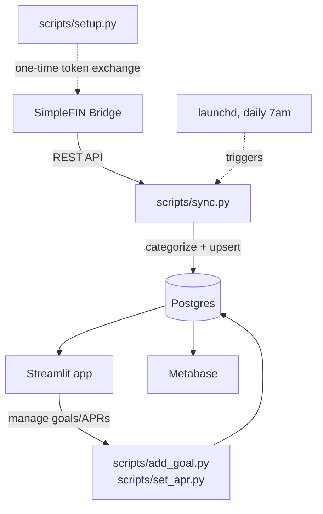
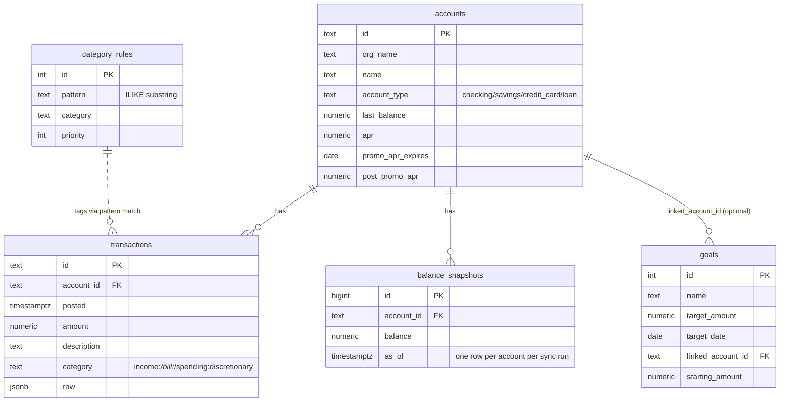

# Architecture

How this system is put together, and why it's built this way.

## Overview

One Postgres database is the single source of truth. A daily script pulls from SimpleFIN and categorizes every transaction on the way in. Two independent presentation layers read from that same database: Metabase for standard BI-style reporting, and a Streamlit app for the parts Metabase can't do — live, cross-filtering KPIs and an interactive debt-payoff simulator with adjustable what-if levers.

## Components

**Ingestion — `scripts/sync.py`**
Pulls accounts, balances, and transactions from the SimpleFIN API, then upserts them into Postgres. Idempotent by SimpleFIN's transaction id, so re-running it is always safe. Also writes a `balance_snapshots` row per account on every run, which is what makes historical balance trends possible later.

**Categorization engine — `category_rules` + `scripts/sync.py`**
Every transaction description is matched against substring rules in `category_rules` (`income:paycheck`, `bill:rent`, etc.), highest-priority match wins. Anything on a credit card that doesn't match any rule falls back to `spending:discretionary` automatically — that one fallback rule is what makes "spending" and "daily spend average" work without hand-tagging every merchant. Rules live in the database, not code, so they're editable without a deploy. A category set by hand (`scripts/set_category.py`) is flagged `category_manual` and the sync never overwrites it; `sync.py --recategorize` re-runs the rules over everything else, which matters because the daily sync only re-fetches a two-week window. The sync exits non-zero when SimpleFIN reports an error or returns no accounts, so a dead bank link fails loudly instead of quietly going stale.

**Storage — Postgres**
Chosen over SQLite specifically because Metabase's SQLite support is a community-maintained driver, not first-class — Postgres is the standard pairing and avoids that friction entirely. Runs in Docker, data lives in a named volume (never in the repo).

**Presentation — Streamlit app**
Metabase (and BI tools generally) can show and filter *stored* data, but can't cross-filter a whole page from one control so that every chart, list and table reconciles to the number you picked, or compare a partial month against the same stretch of the previous one. The dashboard exists for that. An earlier debt-payoff forecasting page was removed as not useful in practice; it is preserved on the `forecasting-archive` branch.

**Presentation — Metabase**
Handles the plain reporting side: trend charts, filters, anything that's really just "query and visualize stored data." Also has a native-SQL card with dashboard-level number filters, which is the closest a BI tool gets to the same live lever the Streamlit app does — useful as a comparison point for what each tool is actually good at.

**Automation — launchd**
Runs `sync.py` daily. macOS-native rather than a bundled scheduler so it keeps running independent of whether any app is open.

## Data model

## Key design decisions

**Rule-based categorization, not ML.** Transaction volume for one person is small (hundreds, not millions), the patterns are stable (an employer name doesn't change often), and rule-based means every categorization decision is inspectable and correctable in one SQL statement — no training data, no black box, no drift to monitor.

**Cash on hand is a monthly snapshot, not always today's live balance.** The Overview page lets you pick any past month. If "cash on hand" always showed today's number regardless of which month was selected, every past month would lie. Instead it picks the daily sync closest to the 15th of whichever month is selected, and shows "n/a" honestly for months before tracking started rather than fabricating a number.

**One filter state drives every visual (the `Show` control in `views/overview.py`).** Click "Bills" and the category chart, the account list, and the transaction list all filter from the *same* computed subset — not five independent filters that can drift out of sync. Totals are printed under each visual specifically so they can be eyeballed against each other and against the KPI itself.

**Spending, Bills, and Income are mutually exclusive by design.** A credit card payment is a required outflow, not a discretionary purchase — conflating the two would make "Spending" mean nothing. `bill:*` (rent, loans, card payments, fees) and `spending:discretionary` (everything else charged) are deliberately separate categories so each KPI answers one specific question.

## Known limitations

- SimpleFIN caps transaction history at 90 days regardless of what's requested — there's no way to backfill years of history through the API; it only accumulates going forward.
- APRs and account types aren't provided by SimpleFIN and must be set manually (`scripts/set_apr.py`, direct SQL) since the data doesn't exist anywhere to sync it from.
- Single-user by design — no auth, no multi-tenancy. This is a personal tool, not a SaaS product.
- Category rules are hand-curated. A rule engine that guesses categories automatically would be a natural next step, but was deliberately skipped in favor of predictability.
